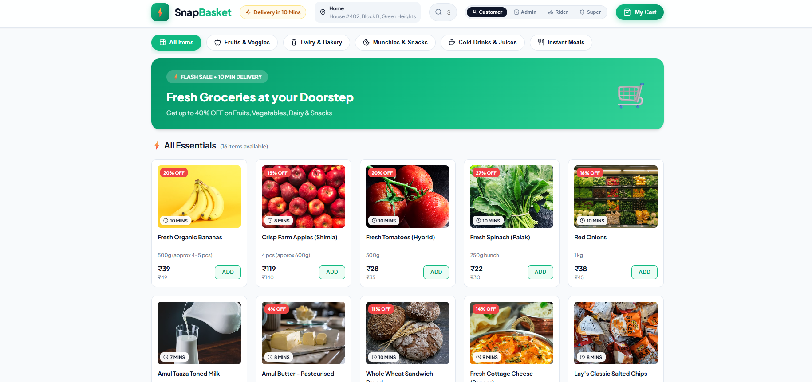
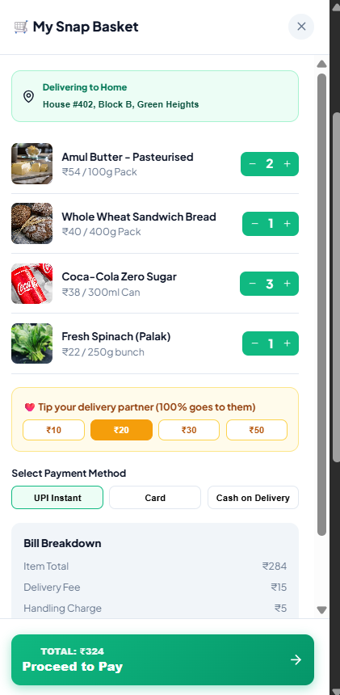
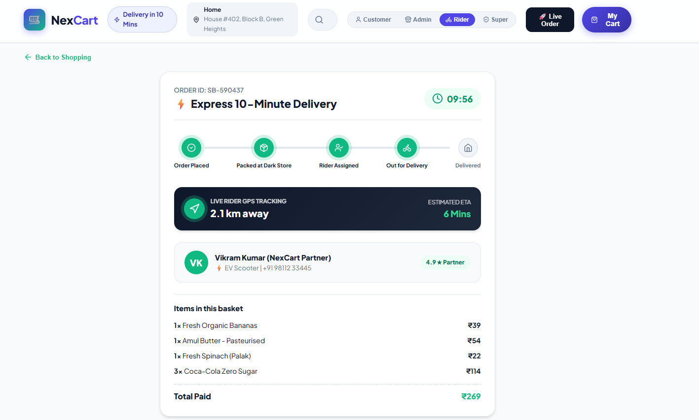
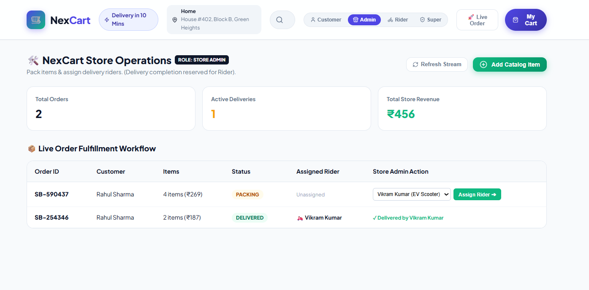
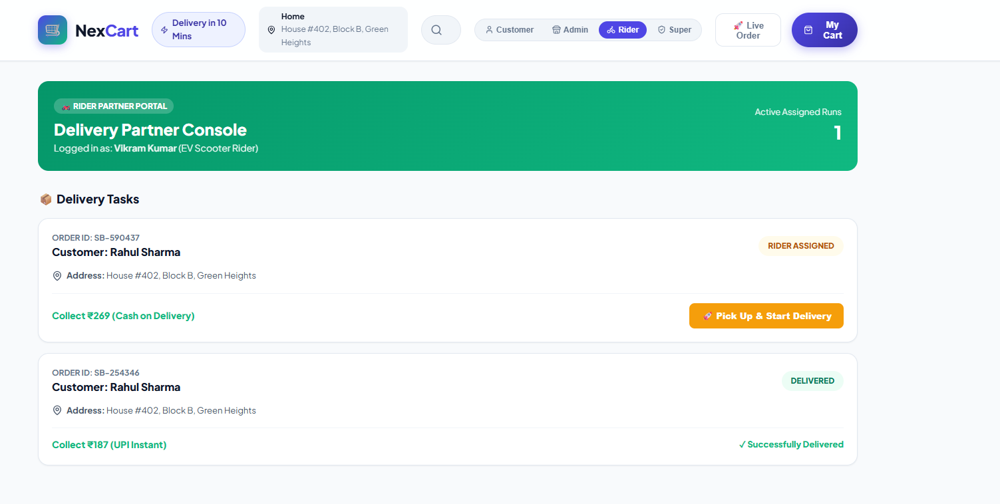

# 🛒 NexCart
> A Full-Stack Quick-Commerce Grocery Delivery Platform built with the MERN Stack.

[](https://reactjs.org/)
[](https://nodejs.org/)
[](https://expressjs.com/)
[](https://www.mongodb.com/)
[](LICENSE)

## 📌 Project Overview

NexCart is a full-stack MERN quick-commerce grocery delivery platform inspired by Blinkit, Zepto, and Instamart. It simulates a 10-minute grocery delivery experience with role-based access control (RBAC), real-time order tracking using Socket.io, inventory management, and dedicated workflows for customers, admins, and riders.

---

## 🚀 Live Demo

- **Frontend Web App**: [https://snap-basket-wine.vercel.app](https://snap-basket-wine.vercel.app)
- **Backend API**: [https://snapbasket-backend.onrender.com](https://snapbasket-backend.onrender.com)

---

## 📸 Screenshots

### 🏠 Customer Storefront & Product Catalog


### 🛒 Slide-Out Cart Drawer & Bill Breakdown


### ⏱️ 10-Minute Live Order Tracking & 5-Stage Timeline


### 🛠️ Store Admin Operations Dashboard


### 🛵 Delivery Partner (Rider) Console


---

## 🛠 Tech Stack

- **Frontend**: React 18, Vite, Context API, Axios, CSS3 (Glassmorphism UI), Lucide Icons, Canvas Confetti
- **Backend**: Node.js, Express.js, REST API Architecture
- **Database**: MongoDB, Mongoose ORM (with automated fallback in-memory engine)
- **Real-Time Communication**: Socket.io / Event-driven state updates
- **Role-Based Access Control**: Multi-Role State Machine (Customer, Store Admin, Delivery Partner, Super Admin)

---

## ✨ Features

### 👤 Customer
- **Category Browsing**: Filter grocery items by category (Fruits & Vegetables, Dairy & Bakery, Munchies, Drinks, Instant Meals).
- **Instant Search**: Search products in real-time by keyword or tag.
- **Cart Management**: Add/remove items, adjust quantities, select partner tips, and view detailed bill breakdowns.
- **10-Minute Delivery Simulation**: Interactive 10-minute countdown timer and 5-stage order progress timeline.

### 🏬 Admin (Store Manager)
- **Store Stream**: View live incoming orders and fulfillment statuses.
- **Order Packing**: Transition order status from `Placed` to `Packing`.
- **Rider Assignment**: Assign available EV riders to packed orders.
- **Catalog Management**: Add new grocery products with pricing, unit weight, category, and image URL.
- **Revenue KPIs**: Track order volume, active deliveries, and store revenue.

### 🛵 Rider (Delivery Partner)
- **Assigned Runs**: View delivery orders assigned to the specific rider.
- **Delivery Control**: Start delivery (`Rider Assigned` ➔ `Out for Delivery`) and update distance milestones.
- **Order Completion**: Exclusively authorized to confirm handover and mark orders as `Delivered`.

---

## 📁 Folder Structure

```
NexCart/
├── backend/
│   ├── config/
│   │   └── db.js                 # Database connection & fallback engine
│   ├── controllers/
│   │   ├── productController.js  # Product management
│   │   └── orderController.js    # Order processing & state machine
│   ├── models/
│   │   ├── Product.js            # Mongoose Product schema
│   │   └── Order.js              # Mongoose Order schema
│   ├── routes/
│   │   ├── productRoutes.js
│   │   └── orderRoutes.js
│   ├── data/
│   │   └── seedData.js           # Grocery seed catalog
│   └── server.js                 # Express server entry point
│
├── frontend/
│   ├── src/
│   │   ├── components/           # Header, ProductCard, CartDrawer, OrderTracker, Admin, Rider
│   │   ├── context/              # CartContext & RBAC state
│   │   ├── services/             # Axios API service
│   │   ├── styles/               # Design system CSS
│   │   └── App.jsx
│   ├── index.html
│   └── vite.config.js
│
├── screenshots/                  # App Screenshots (home, cart, tracker, admin, rider)
└── README.md
```

---

## 💻 Installation & Setup

### Prerequisites
- Node.js (v16.x or higher)
- npm or yarn
- MongoDB (Optional: App includes automatic in-memory fallback)

### 1. Clone the Repository
```bash
git clone https://github.com/Ashutoshe4678/Snap-Basket.git
cd Snap-Basket
```

### 2. Install & Start Backend
```bash
cd backend
npm install
npm start
```
*Backend runs at `http://localhost:5000`*

### 3. Install & Start Frontend
```bash
cd ../frontend
npm install
npm run dev
```
*Frontend runs at `http://localhost:3000`*

---

## 🔑 Environment Variables

Create a `.env` file inside the `backend/` directory:

```env
# Server Port
PORT=5000

# Database Connection String
MONGODB_URI=mongodb://127.0.0.1:27017/nexcart

# Node Environment
NODE_ENV=development
```

---

## 🔮 Future Improvements

- **Payment Gateway Integration**: Integrate Razorpay / Stripe for real online payment processing.
- **SMS / OTP Authentication**: Add Twilio or MSG91 for mobile OTP login verification.
- **Google Maps API**: Embed live interactive map markers for real-time rider GPS tracking.
- **Dark Store Inventory Analytics**: Add automated low-stock warnings and inventory reorder triggers.

---

## 👨‍💻 Author

**Ashutosh**
- **GitHub**: [@Ashutoshe4678](https://github.com/Ashutoshe4678)
- **Project Repository**: [Snap-Basket](https://github.com/Ashutoshe4678/Snap-Basket)
